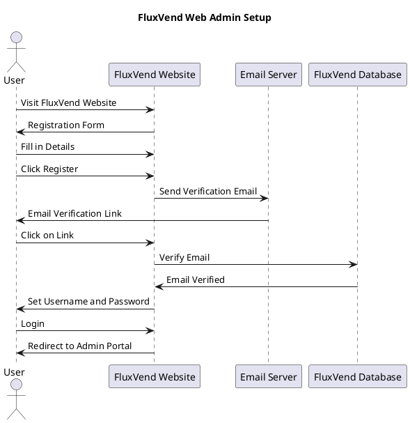

# Web Admin Setup

<link-summary>
 Step-by-step instructions on how to register and log in to the FluxVend Admin Portal.
</link-summary>

### Registering an Account
To begin using FluxVend, you need to create an account. Follow the steps below to register:

Visit the FluxVend website at [www.fluxvend.com/registration](https://fluxvend.com/registration). You will be presented with the registration form to fill in your details.
Fill in your details, including your personal and business information, ensuring to use a valid email address. This email address will be used to verify your account.

Then click the "Register" button to submit your details. 
You will be prompted to verify your email address by clicking on the link sent to your email.

Check your email inbox for an email from FluxVend. Click on the activate button to verify your email address.
This will redirect you to the FluxVend website, where you will be prompted to enter your new username and password.
Once you have successfully activated your account, you will be redirected to the login page.

<procedure title="Registration Procedure" id="registration-procedure">
    <step>Visit the FluxVend website at <a href="https://fluxvend.com/registration">www.fluxvend.com/registration</a></step>
    <step> Fill in your details, including your personal and business information, ensuring to use a valid email address.
        <code-block lang="plantuml">
            @startuml
            package RegistrationForm [
                Business Name
                ----
                Email Address
                ----
                Contact Number
                ----
                First Name
                ----
                Last Name
            ]
            @enduml
        </code-block>
    </step>
    <step>Click the <control>Register</control> button to submit your details.</step>
    <step>Check your email inbox for an email from FluxVend.</step>
    <step>Click on the <control>Activate</control> button to verify your email address.</step>
    <step>Enter your new <control>username</control> and <control>password</control>.</step>
    <step>Once you have successfully activated your account, you will be redirected to the login page.</step>
</procedure>

### Sequence Diagram {collapsible="true"}

### Logging In
After you have successfully registered and activated your account, you can log in to the FluxVend Admin Portal using your newly created credentials.

### What's Next?

Now that you have successfully registered and logged in to the FluxVend Admin Portal, you will be directed to the subscription page. Here, you can <a href="Subscription-Process.md">choose a subscription plan</a> that best suits your business needs.

