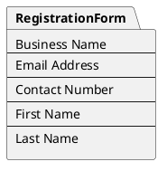

# Web Admin Setup

### Registering an Account
To begin using FluxVend, you need to create an account. Follow the steps below to register:

Visit the FluxVend website at [www.fluxvend.com/registration](https://fluxvend.com/registration). You will be presented with the registration form to fill in your details.
Fill in your details, including your personal and business information, ensuring to use a valid email address. This email address will be used to verify your account.

Then click the "Register" button to submit your details. 
You will be prompted to verify your email address by clicking on the link sent to your email.

Check your email inbox for an email from FluxVend. Click on the activate button to verify your email address.
This will redirect you to the FluxVend website, where you will be prompted to enter your new username and password.
Once you have successfully activated your account, you will be redirected to the login page.

### Sequence Diagram

### Logging In
After you have successfully registered and activated your account, you can log in to the FluxVend Admin Portal using your newly created credentials.
